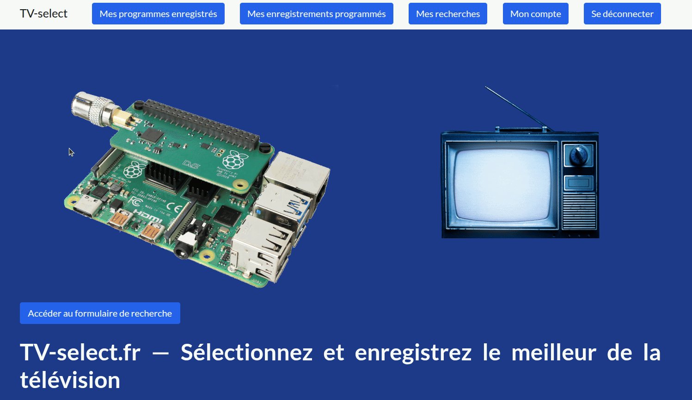

# 📺 tvselect-fr-live-stream v2.2.1

> 🔍 Turn TV into a discovery engine
> 📼 Automatically record TV programs based on your interests



---


---

## 🍿 How TV Select works

TV Select turns TV into a **personal discovery engine**.

You define what you care about:

* a documentary about wine 🍷
* a history episode 🏛️
* a space report 🚀
* that rare movie you couldn’t find anywhere 🎬
* a tennis documentary your son will love 🎾

Then the system works for you:

1. 🔍 Your searches are analyzed
2. 🧠 TV programs are continuously scanned
3. 🎯 When a match is found:

   * 📧 You receive a notification
   * 📼 A recording is triggered automatically

👉 No manual searching. No scheduling.

---

## 📖 TV Select Ecosystem

This project is part of the **TV Select ecosystem**.

👉 Overview & setup guide:

[](https://github.com/tv-select)


### 🌐 tvselect-fr-live-stream

- Records from online TV streams
- Works on any internet-connected device

👉 Best for:
- Simplicity
- ARM boards / Raspberry Pi / VPS / remote servers
- No antenna available

---

## 📁 Output

Videos are stored in:

```bash id="pathvid"
~/videos_select
```

Format:

title + video_id + search + channel.ts

---

## ⚡ Installation (live-stream version)

### Requirements

- Linux
- Python 3
- TV Select account

---

### Install dependencies

```bash id="install1"
sudo apt update && sudo apt install at curl unzip virtualenv ffmpeg
```

---

### Download

```bash id="install2"
cd ~
curl -L -o tvselect-fr-live-stream.zip https://github.com/tvselect/tvselect-fr-live-stream/archive/refs/tags/v2.2.0.zip
unzip tvselect-fr-live-stream.zip
mv tvselect-fr-live-stream-2.2.0 tvselect-fr-live-stream
```

---

### Setup

```bash id="setup"
mkdir -p ~/.local/share/tvselect-fr-live-stream ~/.config/tvselect-fr-live-stream

cd ~/.local/share/tvselect-fr-live-stream
virtualenv -p python3 .venv
source .venv/bin/activate
pip install -r ~/tvselect-fr-live-stream/requirements.txt

cd ~/tvselect-fr-live-stream
python3 install.py
```

---

## 🧩 Architecture

Search → Match → Record → Watch

---

## ❓ FAQ

### Nothing happens?

Normal. Wait for a match.

---

### How long?

It depends on your search.

- Popular topics → results can appear within a day
- Rare content → may take longer

Set it once.
Forget it.

You'll be notified when something matches.

---

### Does it run continuously?

Yes.

---

## ⚠️ Limitations

When recording live TV streams from websites, audio/video desynchronization may occur.

👉 You may notice the audio being ahead or behind the video (typically around ±7 seconds).

This happens because streaming protocols (such as HLS or MPEG-DASH) use segmented media, and audio/video segments can occasionally be slightly misaligned.

### 🛠️ How to fix it

You can easily correct this using a media player:

- **VLC**
  - Press `K` → delay audio
  - Press `J` → advance audio

- **MPV**
  - `Ctrl + +` → delay audio
  - `Ctrl + -` → advance audio

👉 Most issues are fixed with a ±7000 ms adjustment.

---

💡 This limitation comes from the source stream itself and cannot always be avoided.

## ⭐ Support

- Star the repo
- Share it

---

## ⚠️ Disclaimer

For personal use only.
